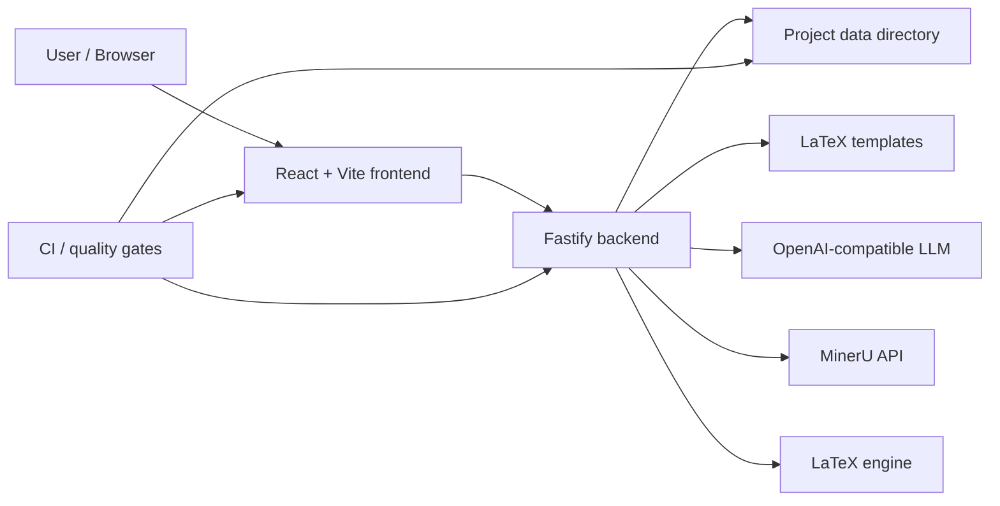
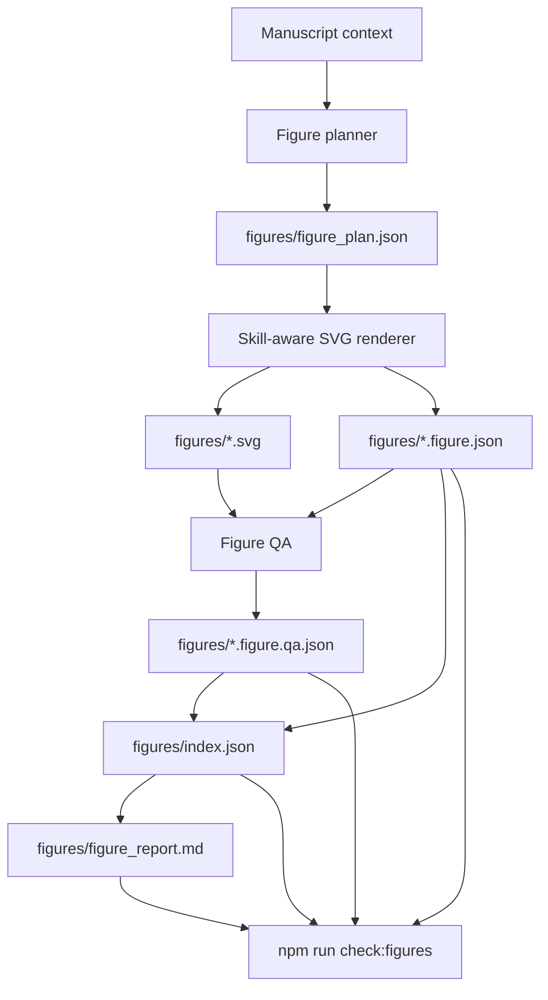

# PaperForge Architecture

PaperForge is a local-first academic writing workbench. It combines a React/Vite editor, a Fastify backend, local project storage, LaTeX compilation, OpenAI-compatible LLM calls, collaboration, and the Figure Agent workflow.

## System Overview



## Runtime Components

| Component | Location | Responsibility |
|---|---|---|
| Frontend app | `apps/frontend` | Editor UI, PDF preview, settings, Figure Agent controls, project navigation |
| Backend API | `apps/backend/src` | Projects, compile, LLM proxy, arXiv/search, vision, plotting, transfer, collaboration |
| Shared types | `packages/shared` | Shared TypeScript types |
| Templates | `templates` | Built-in academic LaTeX templates |
| Project data | `data` or `PaperForge_DATA_DIR` | Local project files, generated assets, refs, drafts, figures |
| Scripts | `scripts` | Quality gates such as Figure Agent asset validation |

## Backend Routes

| Route module | Main purpose |
|---|---|
| `routes/projects.js` | Project CRUD, file tree, upload/download, template creation |
| `routes/compile.js` | LaTeX compilation |
| `routes/llm.js` | OpenAI-compatible LLM endpoint proxy |
| `routes/agent.js` | AI writing agent and patch generation |
| `routes/arxiv.js` | Paper search and citation workflows |
| `routes/vision.js` | Image/formula/table recognition through VLM-capable endpoints |
| `routes/plot.js` | Table-to-chart generation |
| `routes/transfer.js` | Template transfer and MinerU-assisted PDF workflows |
| `routes/collab.js` | Real-time collaboration |
| `routes/health.js` | Health check and template metadata |

## Project Data Layout

A project under `data/<project-id>/` usually contains:

```text
project.json
*.tex
*.bib
drafts/
refs/
figures/
assets/
.compile/
```

Figure Agent assets live under `figures/`:

```text
figures/figure_plan.json
figures/<name>.svg
figures/<name>.figure.json
figures/<name>.figure.qa.json
figures/index.json
figures/figure_report.md
```

## Figure Agent Workflow

For step-by-step usage, see [Figure Agent Guide](FIGURE_AGENT.md).



The workflow is designed around reusable assets rather than one-off images:

- Planning creates candidate figures with purpose, section, caption, label, and risks.
- Generation creates an SVG plus a structured `.figure.json` package.
- QA creates a `.figure.qa.json` report with score, verdict, issues, and revision prompt.
- Registry tracks all generated figures in `figures/index.json`.
- Report export creates `figures/figure_report.md` for review and handoff.
- `npm run check:figures` validates asset consistency.

## LLM Configuration

PaperForge uses OpenAI-compatible APIs. Configuration can come from the UI settings or environment variables:

```text
PaperForge_LLM_ENDPOINT
PaperForge_LLM_API_KEY
PaperForge_LLM_MODEL
PaperForge_LLM_THINKING
PaperForge_LLM_THINKING_MODE
```

Search and vision workflows can reuse the main LLM configuration or use separate settings from the frontend.

## Deployment

### Local Development

```bash
npm install
npm run dev
```

The frontend runs on Vite and the backend runs on Fastify.

### Production

```bash
npm run build
npm start
```

The backend serves `apps/frontend/dist` when it exists.

### Docker

```bash
cp .env.example .env
docker compose up --build
```

Docker exposes port `8787` and persists project files in the `paperforge-data` volume.

## Quality Gates

| Command | Purpose |
|---|---|
| `npm run typecheck` | TypeScript checks |
| `npm run lint` | ESLint checks |
| `npm run test` | Backend unit tests |
| `npm run check:figures` | Figure Agent asset consistency |
| `npm run build` | Production frontend build |
| `npm run check` | Full local quality gate |

GitHub Actions runs the same core checks on push and pull requests.

## Security Notes

- Do not commit `.env`, API keys, private manuscripts, collaboration tokens, or generated private project data.
- Public tunnel modes should be used with collaboration tokens enabled.
- Keep `PaperForge_COLLAB_TOKEN_SECRET` strong when exposing the service outside localhost.
- See `SECURITY.md` for vulnerability reporting.
